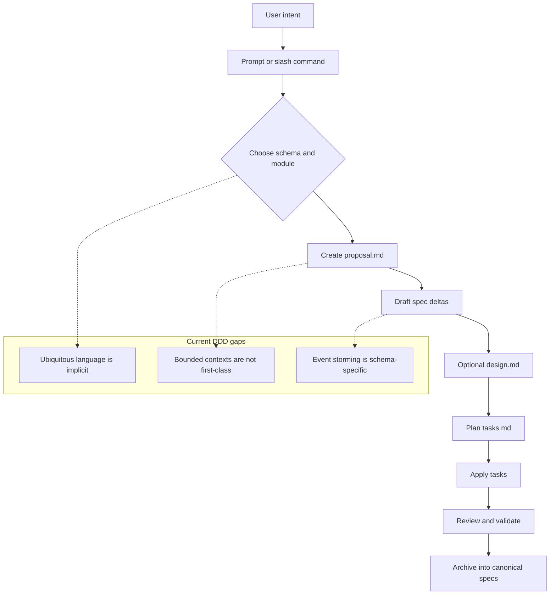
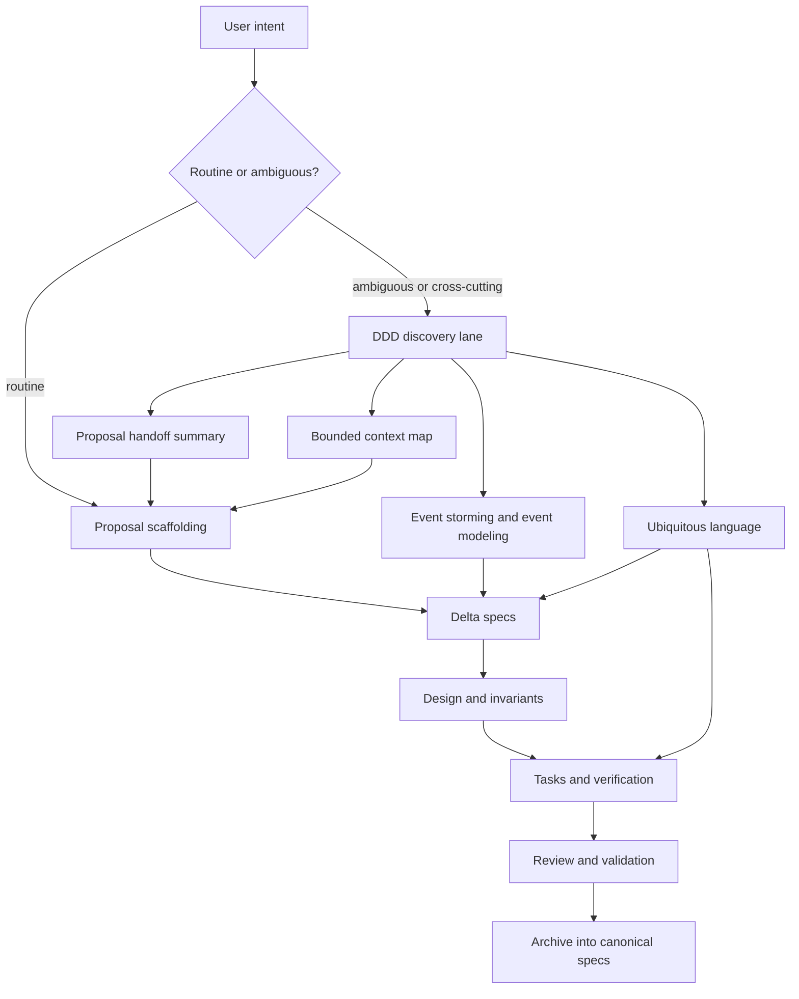

<!-- ITO:START -->
## Context

Ito already has a good artifact lifecycle:

1. discover or frame a change,
2. create a proposal,
3. draft delta specs,
4. optionally write design,
5. derive tasks,
6. implement and validate,
7. archive into canonical specs.

The problem is that the default workflow is still artifact-first rather than domain-first. The current default path asks good scoping questions, but it does not force a shared language pass before proposal authoring. DDD concepts show up only in pockets:

- `event-driven` already has `event-storming.md` and `event-modeling.md`.
- `spec-driven` now supports richer metadata like `Rules / Invariants` and `State Transitions`.
- planning work is being moved toward a lighter `ito-plan` lane in `001-32_add-planning-workflow`.

That leaves a gap: domain discovery is available, but it is not the default mental model for ambiguous or cross-cutting work.

## Current Workflow Model



## Goals / Non-Goals

**Goals:**

- Make domain discovery a first-class lane before proposal scaffolding for ambiguous, architectural, and cross-context work.
- Give Ito a lightweight DDD discovery bundle that works even when the final schema is `spec-driven`.
- Preserve the distinction between Ito modules, capabilities, and DDD bounded contexts.
- Carry discovery outputs forward into proposal, specs, tasks, and review in a traceable way.
- Keep new validation opt-in and incremental, following the quiet-default pattern established in `001-33`.

**Non-Goals:**

- Do not force every small fix or tooling tweak through full DDD discovery.
- Do not redefine modules as bounded contexts.
- Do not make event-driven architecture mandatory for ordinary changes.
- Do not replace spec deltas with sticky-note-style workshop artifacts.

## Proposed Workflow Model



## Discovery Bundle

The new workflow should treat domain discovery as a reusable bundle rather than a separate architecture religion. The bundle has four outputs:

1. **Ubiquitous language**
   - Canonical terms, aliases to avoid, overloaded terms, and short definitions.
   - Output goal: remove naming ambiguity before proposal/spec drafting.

2. **Bounded context map**
   - Which contexts exist, what each owns, and how they relate.
   - Output goal: avoid using Ito modules or code directories as a proxy for business boundaries.

3. **Event storming / event modeling snapshot**
   - Commands, domain events, actors, policies, aggregates, read models, invariants.
   - Output goal: discover what actually happens before drafting requirements.

4. **Proposal handoff summary**
   - A compact transfer object from discovery into proposal creation.
   - Output goal: keep proposal scaffolding grounded in domain language and context boundaries.

## Decisions

### Decision: Put DDD discovery before proposal scaffolding, not inside proposal prose

- **Chosen**: add a dedicated discovery lane that produces structured inputs for proposals.
- **Alternatives considered**: ask proposal authors to improvise DDD concepts inside `proposal.md`.
- **Rationale**: proposals are too late for first-pass language cleanup. Discovery needs a separate moment where the question is "what is the domain model?" rather than "how do I document the change?"

### Decision: Reuse event-storming concepts across schemas

- **Chosen**: make event storming a reusable discovery technique even when the final change uses `spec-driven`.
- **Alternatives considered**: keep event storming exclusive to `event-driven`.
- **Rationale**: event storming is useful for extracting intent and boundaries even when the final software is not event-driven.

### Decision: Keep bounded contexts distinct from modules and capabilities

- **Chosen**: treat bounded contexts as domain-model boundaries; treat modules as change-grouping epics; treat capabilities as durable spec slices.
- **Alternatives considered**: collapse one or more of these concepts into the same object.
- **Rationale**: the concepts answer different questions. Modules group work. Capabilities define system behavior. Bounded contexts define where a language/model is valid.

### Decision: Keep validators opt-in and advisory-first

- **Chosen**: add `ubiquitous_language_consistency` and `context_boundary_consistency` as opt-in rules under existing validators.
- **Alternatives considered**: enable DDD validation by default for every change.
- **Rationale**: DDD improves clarity, but rigid enforcement would create too much friction for small or local changes.

## Contracts / Interfaces

The proposal handoff should be explicit enough that later phases can consume it. A lightweight shape:

```markdown
## Domain Discovery Summary
- Primary problem: <one sentence>
- Canonical terms: <term -> meaning>
- Rejected aliases: <alias -> canonical term>
- Bounded contexts: <name -> responsibility>
- Cross-context relationships: <upstream/downstream or published language>
- Commands: <command list>
- Domain events: <past-tense event list>
- Policies / invariants: <rule list>
- Candidate capabilities: <capability list>
- Open questions: <list>
```

Potential validator surfaces:

- `ubiquitous_language_consistency`
  - warn when proposal/spec/task language drifts from the discovery glossary.
- `context_boundary_consistency`
  - warn when a proposal spans multiple bounded contexts without naming the affected contexts or their relationship.

## Data / State

Recommended artifact flow:

| Stage | Artifact | Primary use |
| --- | --- | --- |
| planning | discovery plan or topic doc | synthesize the domain conversation |
| planning | event-storming notes | capture commands, events, actors, policies |
| proposal | proposal handoff summary | define change scope from the discovery output |
| specs | requirements plus rules/invariants/state | translate discovery into durable behavior |
| review | context-aware checklist | catch language or boundary drift |

The exact file split can stay lightweight. One planning doc with clearly marked sections is acceptable; separate files are acceptable when the topic is large.

## Risks / Trade-offs

- **Too much ceremony for small work.**
  - Mitigation: trigger the DDD lane only for ambiguous, architectural, or cross-context requests.
- **Terminology policing can become noisy.**
  - Mitigation: default to warnings and require opt-in.
- **Overlap with `001-32` and `001-33`.**
  - Mitigation: treat this change as an extension of those proposals, not a competing redesign.
- **False precision in context mapping.**
  - Mitigation: allow provisional contexts and explicit open questions instead of pretending every boundary is settled.

## Verification Strategy

- Schema/template tests for the new discovery artifacts or sections.
- Validator tests for language-consistency and context-boundary rules.
- Instruction rendering tests showing the discovery lane appears for planning/proposal entrypoints.
- End-to-end CLI/skill tests that show discovery outputs can feed proposal scaffolding without forcing the `event-driven` schema.

## Migration / Rollback

- Existing projects keep using current proposal flows until they opt into the new discovery lane or validators.
- If the discovery bundle proves too heavy, rollback can remove the new prompts and rules without changing archived spec formats.

## Open Questions

- Should the discovery bundle be one flexible planning document, or a small set of named artifacts with shared headings?
- Should proposal review require explicit context-map coverage when more than one bounded context is listed?
- Should Ito eventually surface context maps in the web UI or proposal viewer, or keep them markdown-only?
<!-- ITO:END -->
