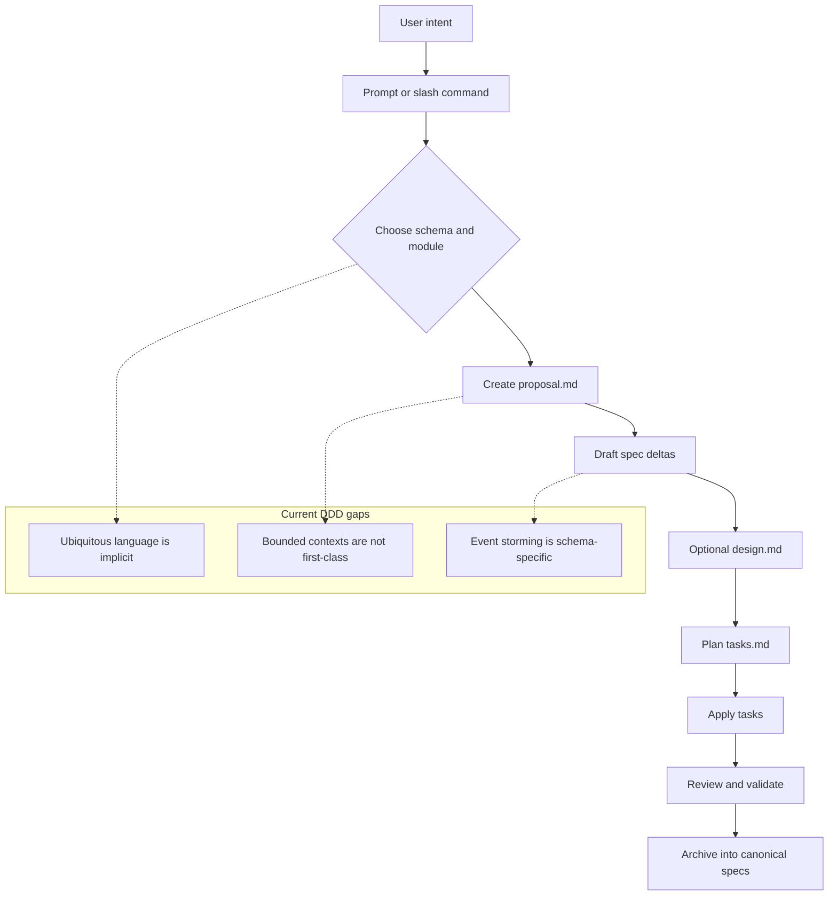
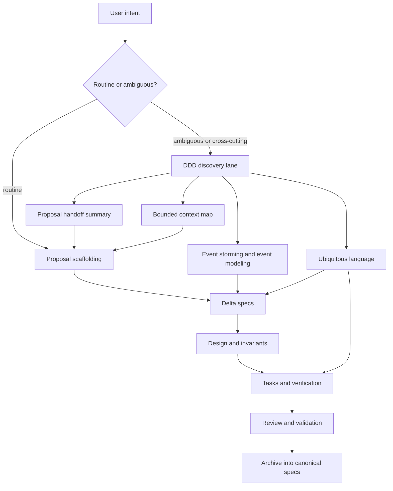

<!-- ITO:START -->
## Context

Ito already has a good artifact lifecycle:

1. discover or frame a change,
2. create a proposal,
3. draft delta specs,
4. optionally write design,
5. derive tasks,
6. implement and validate,
7. archive into canonical specs.

The problem is that the default workflow is still artifact-first rather than domain-first. The current default path asks good scoping questions, but it does not force a shared language pass before proposal authoring. DDD concepts show up only in pockets:

- `event-driven` already has `event-storming.md` and `event-modeling.md`.
- `spec-driven` now supports richer metadata like `Rules / Invariants` and `State Transitions`.
- planning work is being moved toward a lighter `ito-plan` lane in `001-32_add-planning-workflow`.

That leaves a gap: domain discovery is available, but it is not the default mental model for ambiguous or cross-cutting work.

## Dependencies

This change should be implemented as a follow-on to two adjacent workflow changes:

- `001-32_add-planning-workflow`, because domain-grill discovery targets planning and `ito-plan` entrypoints.
- `001-33_enhance-spec-driven-workflow-validation`, because the proposed validators follow that change's quiet-default validation model.

If those changes are not merged first, implementation should either stack on their branches or replace the referenced assets with the final names introduced by those changes.

## Current Workflow Model



## Goals / Non-Goals

**Goals:**

- Make domain discovery a first-class lane before proposal scaffolding for ambiguous, architectural, and cross-context work.
- Give Ito a lightweight DDD discovery bundle that works even when the final schema is `spec-driven`.
- Preserve the distinction between Ito modules, capabilities, and DDD bounded contexts.
- Carry discovery outputs forward into proposal, specs, tasks, and review in a traceable way.
- Keep new validation opt-in and incremental, following the quiet-default pattern established in `001-33`.

**Non-Goals:**

- Do not force every small fix or tooling tweak through full DDD discovery.
- Do not redefine modules as bounded contexts.
- Do not make event-driven architecture mandatory for ordinary changes.
- Do not replace spec deltas with sticky-note-style workshop artifacts.

## Proposed Workflow Model



## Discovery Bundle

The new workflow should treat domain discovery as a reusable bundle rather than a separate architecture religion. The bundle has six outputs:

0. **Discovery depth**
    - Direct/skip, lightweight discovery, bounded-context discovery, or rigorous domain-grill.
    - Output goal: ask enough questions for the risk without making every proposal heavyweight.

1. **Ubiquitous language**
    - Canonical terms, aliases to avoid, overloaded terms, and short definitions.
    - Output goal: remove naming ambiguity before proposal/spec drafting.

2. **Bounded context map**
    - Which contexts exist, what each owns, how they relate, and where translation boundaries sit.
    - Output goal: avoid using Ito modules or code directories as a proxy for business boundaries.

3. **Business capability and model ownership**
    - The business/domain capability, primary context, supporting contexts, owned concepts, and external concepts.
    - Output goal: start from meaning and ownership rather than files, tables, or existing shared models.

4. **Technique-fit decision**
    - Which DDD techniques are useful for this request and which would be unnecessary ceremony.
    - Output goal: keep strategic DDD lightweight and proportional.

5. **Event storming / event modeling snapshot, when useful**
    - Commands, queries when relevant, domain events, actors, policies, aggregates, read models, consistency requirements, invariants.
    - Output goal: discover temporal behavior before drafting requirements when sequencing, reactions, or policies matter.

6. **Proposal handoff summary**
    - A compact transfer object from discovery into proposal creation.
    - Output goal: keep proposal scaffolding grounded in domain language and context boundaries.

## Discovery Depth Gate

The gate is the synthesis point between Ito's low-friction workflow and the user's preference for rigorous questioning when it matters.

| Depth | Trigger | Behavior |
| --- | --- | --- |
| Direct / skip | Routine, low-risk, one-context work with clear vocabulary | Keep the normal proposal or implementation path. |
| Lightweight discovery | Vocabulary is fuzzy or terms are overloaded, but scope is otherwise bounded | Resolve canonical terms and open questions. |
| Bounded-context discovery | Work is clear but crosses ownership, integrations, modules, capabilities, or multiple domain models | Identify primary/supporting contexts, ownership, relationship pattern or provisional unknown, and translation boundary. |
| Rigorous domain-grill | User opts in, or work is high-impact, architectural, public-contract-changing, hard to reverse, policy-heavy, sequencing-heavy, or cross-context with unresolved ownership | Ask evidence-backed, dependency-ordered questions one at a time with recommended answers. |

Clear cross-context work should not fully skip discovery; the minimum depth is bounded-context discovery. Rigorous domain-grill should be auto-recommended for high-impact ambiguity and available by explicit user opt-in, but it should not become the universal default.

## Canonical Handoff Contract

Discovery outputs need enough structure for later phases to consume them without turning the workflow into a heavy modeling tool. Ito should support the same contract either as a standalone `domain-discovery.md` artifact or as an embedded `## Domain Discovery Summary` section declared by a schema.

Required fields or headings:

- **Primary problem**: one sentence describing the domain problem.
- **Discovery depth**: direct, lightweight, bounded-context, or rigorous domain-grill, with trigger rationale.
- **Business/domain capability**: the business capability being changed, distinct from Ito capability.
- **Primary bounded context**: the context that owns the main behavior.
- **Supporting contexts**: other contexts referenced or affected.
- **Canonical terms**: term-to-definition mapping.
- **Rejected aliases / overloaded terms**: aliases to avoid and terms that need context.
- **Bounded contexts**: context names, responsibilities, ownership, and owned language.
- **Owned concepts changed**: rules, lifecycle, language, or decisions owned by the primary context.
- **External concepts referenced**: concepts borrowed from other contexts.
- **Cross-context relationships**: upstream/downstream relationships, relationship pattern or provisional unknown, published language, anti-corruption or translation boundaries.
- **Translation required**: where external concepts become local concepts.
- **Consistency requirements**: strong/eventual consistency expectations, conflict owner, stale-data impact, and downstream-unavailable behavior when relevant.
- **Technique fit**: selected and skipped DDD techniques with rationale.
- **Candidate capabilities**: proposed Ito capability names informed by discovery.
- **Open questions**: unresolved vocabulary, ownership, policy, or sequencing questions.
- **Evidence checked**: specs, code, context docs, or ADRs consulted before asking the user.
- **Proposed documentation updates**: `CONTEXT.md`, `CONTEXT-MAP.md`, or ADR updates that should accompany the change if approved.

Optional event-storming fields when event storming is selected:

- **Actors**
- **Commands**
- **Queries / read-model questions**
- **Domain events**
- **Policies**
- **Aggregates / entities**
- **Read models**
- **Invariants**

## Technique Fit

| Technique | Use when | Skip when |
| --- | --- | --- |
| Ubiquitous language | Terms are overloaded, inconsistent, or domain-specific | The request is a local mechanical change with no domain vocabulary ambiguity |
| Bounded context mapping | Work crosses ownership, capabilities, modules, integrations, or multiple domain models | The change affects one clearly bounded behavior with no translation boundary |
| Event storming | Behavior depends on sequence, domain events, policies, actors, reactions, or invariants | The behavior is static, already specified, and not event- or policy-heavy |

Context relationship vocabulary should be lightweight and advisory:

- **Customer/supplier**: one context provides a stable contract that another consumes.
- **Conformist**: downstream intentionally adopts the upstream model.
- **Anti-corruption layer**: downstream translates to protect a local model.
- **Shared kernel**: contexts deliberately share a small stable model.
- **Separate ways**: similar concepts evolve independently without direct integration.

For cross-context work, record one of these patterns, another explicit relationship, or `provisional/unknown`. Do not force false precision.

## Domain Grill Mode

The pasted `grill-with-docs` skill contributes a strong interaction model: do not accept fuzzy plans at face value. Ito should synthesize that into a focused domain-grill mode for discovery, with three constraints that keep it compatible with Ito:

- Ask one unresolved question at a time, but first explore repository evidence when docs or code can answer it.
- For each human question, provide a recommended answer and explain why.
- Walk the design tree in dependency order, so downstream choices are not discussed until upstream vocabulary, ownership, or boundary questions are settled.

Domain grill mode should challenge four kinds of weakness:

| Weakness | Challenge behavior |
| --- | --- |
| Glossary conflict | Compare user language against `CONTEXT.md`, `CONTEXT-MAP.md`, specs, and the discovery handoff; surface conflicts immediately. |
| Fuzzy language | Propose a precise canonical term and record unresolved ambiguity. |
| Boundary ambiguity | Invent concrete scenarios that probe ownership, lifecycle, failure, and translation boundaries. |
| Claim/code mismatch | Cross-check user claims against code, specs, and ADRs before accepting them as domain truth. |
| Model/data ownership confusion | Ask who owns the rules, lifecycle, language, and decision authority instead of who owns the table or file. |
| Boundary-smell request | Challenge plans like `add a status`, `reuse the existing model`, `just sync the data`, `expose this field`, `put it in shared`, `add a flag`, or `use a helper/common service`. |

## Domain Documentation Capture

The skill's documentation model is valuable, but Ito should route it through change-driven development rather than mutating canonical docs outside the proposal lifecycle.

Discovery should look for domain docs in this order:

1. `CONTEXT-MAP.md` at the repo root. If present, use it to find each bounded context's `CONTEXT.md` and `docs/adr/` directory.
2. Root `CONTEXT.md` and root `docs/adr/` for single-context repositories.
3. No existing files. Create proposed docs lazily only when a durable term, context boundary, or ADR-worthy decision has been resolved.

Documentation capture rules:

- `CONTEXT.md` captures domain-expert language only, not implementation details.
- `CONTEXT-MAP.md` captures bounded contexts and where their local docs live.
- ADRs are offered only when the decision is hard to reverse, surprising without context, and based on a real trade-off.
- During proposal work, documentation updates are proposed in the active change/worktree and are not canonical truth until reviewed and approved.
- After approval, apply/archive/finish guidance promotes proposed domain-doc updates to the discovered `CONTEXT.md`, `CONTEXT-MAP.md`, or `docs/adr/` locations.

## Integrated Skill Ideas and Conflicts

Best ideas to adopt:

- Relentless plan stress-testing becomes a targeted domain-grill mode for ambiguous, architectural, or cross-context work.
- `CONTEXT.md` and `CONTEXT-MAP.md` become optional domain knowledge sources and documentation targets.
- ADR creation is sparse and decision-driven, not a default output.
- Existing docs and code are treated as evidence before asking the user to restate domain facts.
- Concrete scenarios are used to force precision around boundaries and edge cases.
- The strategic DDD guide contributes capability-first framing, model-ownership probes, relationship-pattern vocabulary, consistency questions, and boundary-smell prompts.

Conflicts to avoid:

- The skill says to interview relentlessly; Ito's proposal guidance says to ask the smallest number of questions needed. Synthesis: ask relentlessly only within the selected domain-grill lane, and still ask one targeted question at a time.
- The skill says to update `CONTEXT.md` inline as decisions crystallize; Ito has a proposal approval gate. Synthesis: capture proposed documentation updates in the change worktree/package, then make them canonical only through the approved change.
- The skill assumes generic root `CONTEXT.md` / `docs/adr/` conventions; Ito repositories may use modules, specs, generated mirrors, or backend-backed state. Synthesis: discover existing documentation locations first and create files lazily only when durable domain knowledge exists.
- The strategic guide says to pause until the model is clear; Ito should instead require the model to be clear enough for the selected change depth, with unresolved questions explicitly captured.
- The strategic guide contains tactical implementation rules, refactoring advice, test naming guidance, and long examples. Synthesis: bundle them as reference-only material, not mandatory workflow contract.

## Decisions

### Decision: Put DDD discovery before proposal scaffolding, not inside proposal prose

- **Chosen**: add a dedicated discovery lane that produces structured inputs for proposals.
- **Alternatives considered**: ask proposal authors to improvise DDD concepts inside `proposal.md`.
- **Rationale**: proposals are too late for first-pass language cleanup. Discovery needs a separate moment where the question is "what is the domain model?" rather than "how do I document the change?"

### Decision: Synthesize grill-style questioning as a conditional mode

- **Chosen**: add a domain-grill mode for high-impact, architectural, ambiguous, policy-heavy, sequencing-heavy, or explicitly opted-in discovery, not for every proposal.
- **Alternatives considered**: adopt relentless questioning for all proposal work.
- **Rationale**: the questioning style is useful when domain ambiguity is high, but it conflicts with Ito's goal of low-friction proposal creation for clear changes.

### Decision: Bundle the strategic DDD guide as reference material

- **Chosen**: keep `artifacts/strategic_ddd_for_coding_agents.md` available as supporting reference while integrating only the highest-value concepts into the canonical handoff.
- **Alternatives considered**: copy the full guide into default workflow instructions or ignore it after proposal authoring.
- **Rationale**: the guide is useful for deep reasoning, but its full tactical checklist would make routine Ito workflows too heavy.

### Decision: Treat CONTEXT and ADR updates as change-scoped documentation

- **Chosen**: discover and propose updates to `CONTEXT.md`, `CONTEXT-MAP.md`, and ADRs within the change flow.
- **Alternatives considered**: update canonical documentation immediately during discovery.
- **Rationale**: immediate capture is valuable, but canonical docs should follow Ito's review/approval boundary so unapproved proposal language does not become project truth.

### Decision: Promote domain docs only after approval

- **Chosen**: include context/ADR promotion in apply/archive/finish guidance after a change is approved.
- **Alternatives considered**: leave proposed documentation updates in the discovery handoff indefinitely.
- **Rationale**: discovery needs a safe proposal-only capture point, but accepted domain language must eventually land in durable docs or the handoff becomes a dead-end artifact.

### Decision: Reuse event-storming concepts across schemas

- **Chosen**: make event storming a reusable but optional discovery technique even when the final change uses `spec-driven`.
- **Alternatives considered**: keep event storming exclusive to `event-driven`, or require it for every DDD discovery session.
- **Rationale**: event storming is useful for extracting intent and boundaries even when the final software is not event-driven, but forcing it onto simple work would add ceremony.

### Decision: Keep bounded contexts distinct from modules and capabilities

- **Chosen**: treat bounded contexts as domain-model boundaries; treat modules as change-grouping epics; treat capabilities as durable spec slices.
- **Alternatives considered**: collapse one or more of these concepts into the same object.
- **Rationale**: the concepts answer different questions. Modules group work. Capabilities define system behavior. Bounded contexts define where a language/model is valid.

### Decision: Keep validators opt-in and advisory-first

- **Chosen**: add `ubiquitous_language_consistency` and `context_boundary_consistency` as opt-in rules under existing validators.
- **Alternatives considered**: enable DDD validation by default for every change.
- **Rationale**: DDD improves clarity, but rigid enforcement would create too much friction for small or local changes.

## Contracts / Interfaces

The proposal handoff should be explicit enough that later phases can consume it. A lightweight shape:

```markdown
## Domain Discovery Summary
- Primary problem: <one sentence>
- Canonical terms: <term -> meaning>
- Rejected aliases: <alias -> canonical term>
- Bounded contexts: <name -> responsibility, ownership, owned language>
- Business/domain capability: <capability distinct from Ito capability>
- Primary bounded context: <context that owns the behavior>
- Supporting contexts: <other contexts involved>
- Owned concepts changed: <rules/lifecycle/language/decisions>
- External concepts referenced: <concepts from other contexts>
- Cross-context relationships: <pattern or provisional unknown, published language, translation boundary>
- Consistency requirements: <strong/eventual, conflict owner, stale-data impact if relevant>
- Technique fit: <glossary/context map/event storming chosen or skipped with reason>
- Commands: <command list, if event storming selected>
- Queries: <query/read model questions, if interaction modeling selected>
- Domain events: <past-tense event list, if event storming selected>
- Policies / invariants: <rule list, if relevant>
- Candidate capabilities: <capability list>
- Open questions: <list>
```

Potential validator surfaces:

- `ubiquitous_language_consistency`
  - warn when proposal/spec/task language drifts from the discovery glossary.
- `context_boundary_consistency`
  - warn when a proposal spans multiple bounded contexts without naming the affected contexts or their relationship.
- `domain_documentation_consistency`
  - warn when proposed context or ADR updates conflict with the canonical discovery handoff or existing domain docs.

## Data / State

Recommended artifact flow:

| Stage | Artifact | Primary use |
| --- | --- | --- |
| planning | discovery plan or topic doc | synthesize the domain conversation |
| planning | event-storming notes | capture commands, events, actors, policies |
| proposal | proposal handoff summary | define change scope from the discovery output |
| specs | requirements plus rules/invariants/state | translate discovery into durable behavior |
| review | context-aware checklist | catch language or boundary drift |

The physical file split can stay lightweight, but the logical headings must be stable. One planning doc with the canonical summary section is acceptable; a standalone `domain-discovery.md` is preferable when the discovery output is large or needs to survive proposal handoff independently.

## Risks / Trade-offs

- **Too much ceremony for small work.**
  - Mitigation: trigger the DDD lane only for ambiguous, architectural, or cross-context requests.
- **Terminology policing can become noisy.**
  - Mitigation: default to warnings and require opt-in.
- **Overlap with `001-32` and `001-33`.**
  - Mitigation: treat this change as an extension of those proposals, not a competing redesign.
- **False precision in context mapping.**
  - Mitigation: allow provisional contexts and explicit open questions instead of pretending every boundary is settled.
- **Event storming becomes the default even when not useful.**
  - Mitigation: require a technique-fit note that explains why event storming was used or skipped.
- **Documentation capture bypasses proposal review.**
  - Mitigation: capture proposed context/ADR updates in the active change and only archive or merge them after approval.
- **Questioning becomes performative.**
  - Mitigation: require repository exploration before asking answerable questions and require each question to include a recommended answer.

## Verification Strategy

- Schema/template tests for the new discovery artifacts or sections.
- Validator tests for language-consistency and context-boundary rules.
- Instruction rendering tests showing the discovery lane appears for planning/proposal entrypoints.
- End-to-end CLI/skill tests that show discovery outputs can feed proposal scaffolding without forcing the `event-driven` schema.

## Migration / Rollback

- Existing projects keep using current proposal flows until they opt into the new discovery lane or validators.
- If the discovery bundle proves too heavy, rollback can remove the new prompts and rules without changing archived spec formats.

## Open Questions

- Should Ito eventually surface context maps in the web UI or proposal viewer, or keep them markdown-only?
<!-- ITO:END -->
