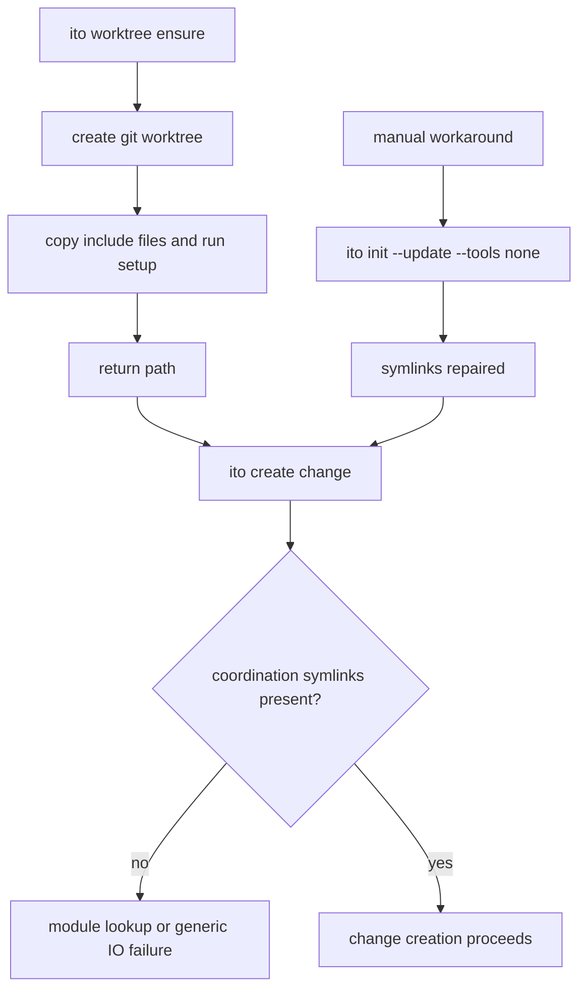
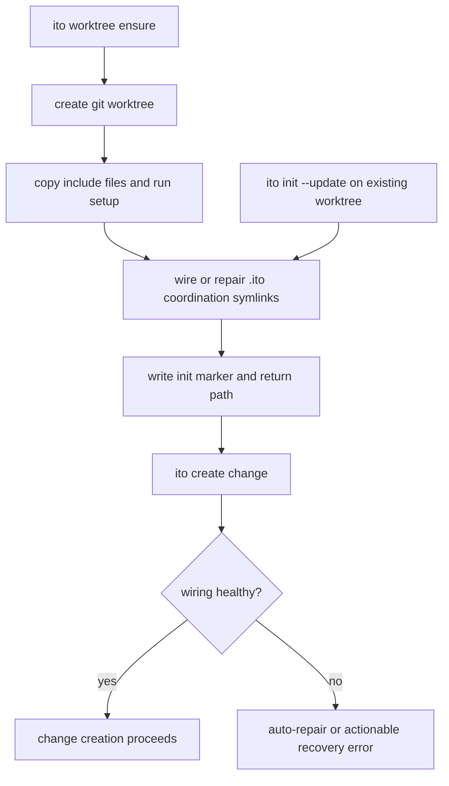

<!-- ITO:START -->
## Context

The observed failure sequence was:

1. Create a new worktree with either `git worktree add ...` or `ito worktree ensure --change <id>`.
2. Enter the worktree and try `ito create change ...`.
3. Discover that `.ito/changes`, `.ito/specs`, `.ito/modules`, `.ito/workflows`, and `.ito/audit` are absent or real directories instead of coordination symlinks.
4. Run `ito init --update --tools none` manually.
5. See the symlinks appear and shared module/spec state become visible.
6. Retry `ito create change ...`, which still fails with a generic `os error 2`.

The code already hints at the root cause. `worktree_init` is only responsible for include-file copy and setup commands, and its doc comment explicitly says coordination symlink wiring is handled separately by the caller. `worktree_ensure` currently creates the Git worktree and runs `worktree_init`, but in the reproduced session it did not create the `.ito` coordination symlinks afterward.

## Goals / Non-Goals

**Goals:**

- Ensure `ito worktree ensure` produces a fully wired Ito worktree in coordination-worktree mode.
- Make symlink repair on an existing worktree explicit and testable.
- Prevent `ito create change` from failing with opaque errors when the real problem is missing coordination wiring.
- Keep the repair path deterministic for both humans and agents.

**Non-Goals:**

- Redesign worktree layout strategy or branch naming.
- Change backend-backed or embedded-storage behavior.
- Fix every possible `os error 2` path in create-change unrelated to coordination wiring.

## Current Flow

## Proposed Flow

## Decisions

### Decision: Make `ito worktree ensure` the primary wiring point

- **Chosen**: after worktree creation, `ito worktree ensure` should wire the `.ito` coordination symlinks before reporting success.
- **Alternatives considered**: rely on `ito init --update` as a separate required step; document the gap only.
- **Rationale**: the current docs and agent prompts already present `ito worktree ensure` as the one-step path. The implementation should match that contract.

### Decision: Keep `ito init --update` as an explicit repair surface

- **Chosen**: existing-worktree repair remains supported through `ito init --update` in coordination-worktree mode.
- **Alternatives considered**: add a brand-new repair-only command immediately.
- **Rationale**: `ito init --update` already repaired the worktree in practice. Formalizing that behavior gives agents a stable fallback while keeping scope bounded.

### Decision: Improve `ito create change` diagnostics even if auto-repair is added

- **Chosen**: `ito create change` should detect missing coordination wiring and emit a targeted message when it cannot repair automatically.
- **Alternatives considered**: rely entirely on upstream `ensure` fixes.
- **Rationale**: users will still create worktrees manually or encounter partial-init drift. Change creation should explain the real failure mode.

## Risks / Trade-offs

- Wiring symlinks during ensure may touch existing real directories. Mitigation: reuse the existing coordination migration behavior in `coordination.rs` rather than inventing a second path.
- Re-running repair on an already healthy worktree must stay idempotent. Mitigation: preserve exact-target checks and no-op when the symlink is already correct.
- `ito create change` may have a second root cause after symlink repair. Mitigation: add path-rich error context while implementing the coordination fix, and keep reproduction coverage from `issues.md`.

## Verification Strategy

- End-to-end tests for `ito worktree ensure` that assert the coordination symlinks exist immediately afterward.
- Regression tests for `ito init --update` on an existing unwired worktree.
- Change-creation tests that verify missing wiring produces a targeted recovery error or auto-repair path instead of a generic `os error 2`.
- Instruction and documentation tests that keep `ito worktree ensure` and the repair fallback in sync.

## Migration / Rollback

- Existing healthy worktrees should be unaffected because wiring is idempotent.
- Existing unhealthy worktrees gain a supported repair path.
- Rollback would remove auto-wiring in `worktree ensure` but should preserve the improved diagnostics if possible.
<!-- ITO:END -->
