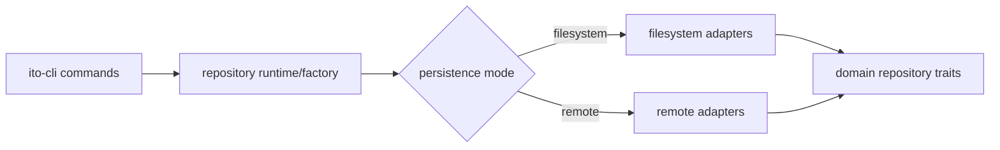

## Context

The codebase already has repository ports and some remote adapters, but command wiring still bypasses them by constructing filesystem repositories directly. That blocks a clean client model where persistence mode is chosen once and reused consistently.

The target architecture is stronger than simple client/server separation: concrete filesystem-backed and SQLite-backed repository implementations should live once in shared core code and be composed in two ways:

- directly by local/client runtimes
- behind HTTP by the backend server

That means the backend server should not carry a second copy of repository behavior. The extra layer in remote mode should be transport, not duplicated storage logic.

## Goals / Non-Goals

- Goals: centralize repository selection, support filesystem and remote modes, and keep remote transport details out of command handlers. Make it easy to add new repository implementations in the future if needed.
- Non-Goals: introducing additional remote transports now or redefining backend server storage internals.

## Decisions

- Introduce a repository runtime/factory that returns the selected repository implementations for the current configuration.
- Keep `filesystem` and `remote` as the client-facing persistence modes.
- Keep REST as the current remote transport implementation behind the remote repository adapters.
- Require commands/helpers to depend on the selected repository set instead of constructing concrete repositories directly.
- For the current REST transport, keep HTTP semantics disciplined: `GET` is read-only, mutations use `POST`/`PUT`/`DELETE` as appropriate, and retryable mutation paths must be idempotent either by verb semantics or explicit idempotency keys.
- Treat concrete filesystem-backed and SQLite-backed repositories as shared implementations in `ito-core` that can be composed directly by local modes and indirectly by the backend server.
- Keep backend server composition thin: HTTP handlers should delegate to shared repository-backed services instead of re-implementing repository behavior.

## Composition Sketch



## Implementation Preferences

- Keep the factory/composition logic in `ito-core`, and expose trait-based repository bundles rather than concrete adapter types.
- Keep runtime/config resolution separate from repository selection.
- Commands should depend on the factory output, not on concrete `Fs*Repository` constructors.
- A likely home is a dedicated `ito-rs/crates/ito-core/src/repository_runtime.rs` (or similarly named) module so composition stays out of `ito-cli`.
- Backend runtime/auth/config concerns should continue to live with the existing backend runtime helpers in `ito-core` rather than being folded into command handlers.
- `ito-cli` should consume a selected repository bundle and format output, not participate in choosing concrete repository classes.
- If the backend needs multi-project lookup, prefer a thin project-store/factory layer that yields the same per-project repository set used by local composition.

## Testing Preference

- Prefer dedicated test files for repository factory composition, mode resolution, and parity/injection cases so the matrix of filesystem, SQLite, and remote behavior stays readable.

## Contract Sketch

Illustrative only; meant to show the composition shape rather than fix exact names.

```rust
pub struct RepositorySet {
    pub changes: Arc<dyn ChangeRepository>,
    pub tasks: Arc<dyn TaskRepository>,
    pub modules: Arc<dyn ModuleRepository>,
    pub specs: Arc<dyn SpecRepository>,
}

pub trait RepositoryFactory {
    fn resolve(&self, mode: PersistenceMode) -> CoreResult<RepositorySet>;
}
```

Suggested error/result pattern:

```rust
pub enum PersistenceMode {
    Filesystem,
    Remote,
}

pub struct RepositorySet {
    pub changes: Arc<dyn ChangeRepository + Send + Sync>,
    pub tasks: Arc<dyn TaskRepository + Send + Sync>,
    pub task_mutations: Arc<dyn TaskMutationService + Send + Sync>,
    pub modules: Arc<dyn ModuleRepository + Send + Sync>,
    pub specs: Arc<dyn SpecRepository + Send + Sync>,
}

pub struct RepositoryFactoryBuilder {
    pub ito_path: PathBuf,
    pub mode: PersistenceMode,
    pub backend_runtime: Option<BackendRuntime>,
}

impl RepositoryFactoryBuilder {
    pub fn build(self) -> CoreResult<RepositorySet> {
        match self.mode {
            PersistenceMode::Filesystem => Ok(RepositorySet {
                changes: Arc::new(FsChangeRepository::new(&self.ito_path)),
                tasks: Arc::new(FsTaskRepository::new(&self.ito_path)),
                task_mutations: Arc::new(FsTaskMutationService::new(&self.ito_path)),
                modules: Arc::new(FsModuleRepository::new(&self.ito_path)),
                specs: Arc::new(FsSpecRepository::new(&self.ito_path)),
            }),
            PersistenceMode::Remote => {
                let runtime = self.backend_runtime.ok_or_else(|| {
                    CoreError::validation("remote mode requires backend runtime".to_string())
                })?;

                let change_reader = Arc::new(HttpChangeReader::new(runtime.clone()));
                let task_reader = Arc::new(HttpTaskReader::new(runtime.clone()));
                let module_reader = Arc::new(HttpModuleReader::new(runtime.clone()));
                let spec_reader = Arc::new(HttpSpecReader::new(runtime.clone()));
                let sync_client = Arc::new(HttpSyncClient::new(runtime));

                Ok(RepositorySet {
                    changes: Arc::new(RemoteChangeRepository::new(change_reader)),
                    tasks: Arc::new(RemoteTaskRepository::new(task_reader)),
                    task_mutations: Arc::new(RemoteTaskMutationService::new(sync_client)),
                    modules: Arc::new(RemoteModuleRepository::new(module_reader)),
                    specs: Arc::new(RemoteSpecRepository::new(spec_reader)),
                })
            }
        }
    }
}
```

The same repository bundle shape should also be usable on the server side:

```rust
pub struct ProjectRepositoryFactory {
    pub storage: StorageMode,
}

impl ProjectRepositoryFactory {
    pub fn for_project(&self, project_key: &ProjectKey) -> CoreResult<RepositorySet> {
        match self.storage {
            StorageMode::Filesystem => build_filesystem(project_ito_path(project_key)),
            StorageMode::Sqlite => build_sqlite(project_sqlite_runtime(project_key)),
        }
    }
}
```

That keeps direct/local and backend/server composition aligned around the same repository contracts and concrete implementations.

The intended pattern is:
- `CoreResult<_>` for factory/build-time composition failures
- `DomainResult<_>` for trait calls used by the application layer
- transport/storage-specific errors get mapped inside adapters before they cross the trait boundary

- the REST transport remains an adapter concern, but its endpoints should still follow proper HTTP method semantics so repository clients can rely on safe retries and predictable behavior

## Transport Sketch

Illustrative only; exact endpoint names can evolve.

```text
GET    /api/v1/projects/{org}/{repo}/changes
GET    /api/v1/projects/{org}/{repo}/changes/{change_id}
PUT    /api/v1/projects/{org}/{repo}/changes/{change_id}/lease
DELETE /api/v1/projects/{org}/{repo}/changes/{change_id}/lease
POST   /api/v1/projects/{org}/{repo}/changes/{change_id}/sync
GET    /api/v1/projects/{org}/{repo}/modules
GET    /api/v1/projects/{org}/{repo}/specs
```

The important part is not the exact URI shape; it is that reads remain safe and mutation endpoints are explicit and retryable.

## Risks / Trade-offs

- Central selection makes mode mistakes more visible, which is good but may expose hidden assumptions quickly.
- Some commands may need helper refactors to accept injected repositories cleanly.

## Migration Plan

1. Define the runtime-selected repository bundle/factory API.
2. Wire existing filesystem and remote implementations into that bundle.
3. Migrate command handlers off direct filesystem repository construction.
4. Add regression tests for both modes across representative commands.
