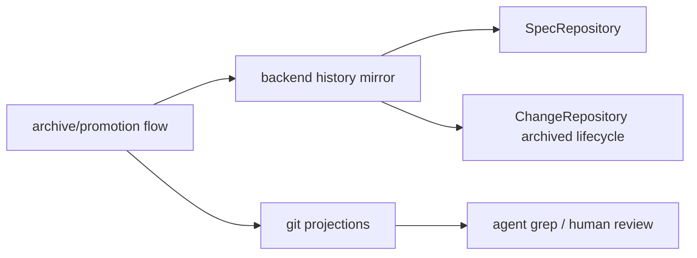

## Context

Active-work repositories are only part of the story. Promoted specs and archived changes also need to be available through the backend for reconciliation and large-scale retrieval, while Git remains valuable as a projection for review, backup, and agent grep workflows.

## Goals / Non-Goals

- Goals: add a spec repository abstraction; make promoted specs and archived changes queryable from backend-managed state; keep Git projections.
- Non-Goals: removing Git projections or requiring agents to consume specs only through an API.

## Decisions

- Introduce `SpecRepository` as the canonical client abstraction for truth-spec reads.
- Treat archived changes as part of `ChangeRepository` lifecycle semantics rather than a separate archive repository.
- Mirror promoted specs and archived changes into backend-managed state while retaining committed Git projections.
- Allow clients to prefer repo/grep over API ergonomically while preserving backend queryability for reconciliation and scale.

## Flow Sketch



## Implementation Preferences

- Add `SpecRepository` as a peer to the other repository traits, with adapters following the same ports/adapters pattern.
- Keep archived-change lifecycle inside `ChangeRepository` rather than introducing a separate archive repository.
- Keep mirroring, Git projection, and reconciliation as separate responsibilities rather than collapsing them into a single large service.
- The likely trait home is a new `ito-domain` repository module near the existing change/task/module repository contracts.
- The likely adapter homes are new `ito-core` modules parallel to the existing repository adapters, while archive/promotion orchestration remains in dedicated services rather than being folded into the repository itself.
- Git projection writing, backend mirroring, and reconciliation should stay as distinct layers so each can evolve without overloading the others.

## Testing Preference

- Prefer dedicated test files for history mirroring, reconciliation, and spec/archive read behavior instead of concentrating all coverage inside archive or repository production files.

## Contract Sketch

Illustrative only; intended to keep spec/history access aligned with the existing repository style.

```rust
pub trait SpecRepository {
    fn list(&self) -> DomainResult<Vec<SpecSummary>>;
    fn get(&self, id: &str) -> DomainResult<SpecDocument>;
}

pub trait HistoryMirror {
    fn mirror_archived_change(&self, change: &Change) -> CoreResult<()>;
    fn mirror_promoted_specs(&self, specs: &[SpecDocument]) -> CoreResult<()>;
}
```

High-level implementation shape:

```rust
pub struct ArchiveMirrorService<M> {
    mirror: Arc<M>,
}

impl<M> ArchiveMirrorService<M>
where
    M: HistoryMirror + Send + Sync + 'static,
{
    pub fn mirror_archive_result(
        &self,
        archived_change: &Change,
        promoted_specs: &[SpecDocument],
    ) -> CoreResult<()> {
        self.mirror.mirror_archived_change(archived_change)?;
        self.mirror.mirror_promoted_specs(promoted_specs)?;
        Ok(())
    }
}
```

This keeps the repository trait focused on reads while a dedicated service handles the stateful archive/spec mirroring workflow.

## Risks / Trade-offs

- Dual representation requires explicit reconciliation rules between backend-managed state and Git projections.
- Archive/promotion flows will become more stateful and need stronger failure handling.

## Migration Plan

1. Define `SpecRepository` and remote-backed truth-spec access.
2. Extend archive/promotion orchestration to mirror promoted specs and archived changes to backend-managed state.
3. Add query/read paths for repository-backed spec retrieval.
4. Add reconciliation-oriented tests for backend mirror plus Git projection behavior.
