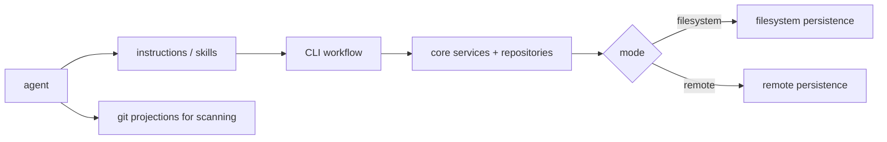

## Context

Agents are good at grepping local files, so they will keep reaching for markdown edits unless the CLI and instructions make the repository-backed workflow more obvious and easier. In remote/API-backed mode, active markdown may not exist locally at all, so the guidance needs to change with the persistence mode.

## Goals / Non-Goals

- Goals: make agent instructions CLI-first in remote mode; discourage direct markdown edits for active work; make the proper command surface practical.
- Non-Goals: replacing all agent workflows with a new assistant-only interface or removing Git projections used for scanning historical state.

## Decisions

- Distinguish clearly between read-oriented Git projections and mutation-oriented CLI/repository-backed flows.
- Treat local absence of active markdown in remote/API-backed mode as normal, not exceptional.
- Update skills/prompts/help surfaces so the preferred tools are explicit and mode-aware.

## Workflow Sketch



## Implementation Preferences

- Keep agent guidance mode-aware but lightweight: it should steer behavior, not duplicate repository logic.
- Put durable workflow rules in maintained instruction assets and skills, not scattered command-specific text.
- Keep CLI ergonomics and repository-backed persistence as separate concerns: guidance should point to the right interface, while persistence remains behind traits/adapters in core.
- The likely touch points are `.ito/AGENTS.md`, embedded template assets under `ito-rs/crates/ito-templates/`, and the installed skill/instruction markdown that teaches agents how to operate.
- If CLI support needs improvement for agent workflows, those command/help changes should remain thin adapters over `ito-core` repository-backed operations.
- The guidance should explicitly distinguish active-work mutation surfaces from Git-projected scan surfaces without re-encoding repository selection rules in prompt text.

## Testing Preference

- Prefer dedicated test files or fixture-driven instruction tests for generated guidance behavior rather than embedding large prompt-behavior suites inline with production code.

## Interface Sketch

Illustrative only; this is about the shape of the guidance input, not prescribing a concrete implementation.

```rust
pub struct AgentWorkflowContext {
    pub persistence_mode: PersistenceMode,
    pub has_local_active_markdown: bool,
    pub has_git_projections: bool,
}

pub fn render_agent_guidance(ctx: &AgentWorkflowContext) -> String {
    // choose guidance based on mode and available surfaces
    todo!()
}
```

## Risks / Trade-offs

- If the CLI authoring surface remains clumsy, agents will continue to drift back to markdown edits.
- Instruction-only changes without ergonomic command improvements will not be durable.

## Migration Plan

1. Audit agent instructions and skills for markdown-edit assumptions.
2. Define mode-aware guidance for active work, promoted specs, and Git projections.
3. Improve CLI discoverability/help for the repository-backed authoring path.
4. Add tests or fixtures that verify generated instructions point agents at the correct tool surfaces.
