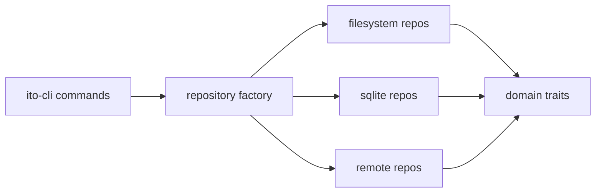

## Context

The backend already has SQLite-backed persistence on the server side. If the client repository abstraction is sound, we should be able to plug a local SQLite-backed implementation into the same trait contracts and get the same command behavior without going through HTTP. That gives us both a useful local mode and a strong architectural test.

## Goals / Non-Goals

- Goals: support local SQLite-backed repositories; preserve command behavior across modes; validate that persistence and transport are cleanly separated.
- Non-Goals: replacing filesystem mode, requiring SQLite for local usage, or collapsing client and server responsibilities into one code path.

## Decisions

- Treat `sqlite` as a client-side persistence mode, separate from `remote`.
- Keep command handlers unaware of whether the selected repositories are filesystem-backed, SQLite-backed, or remote-backed.
- The backend server should compose the same SQLite-backed repositories used by direct local mode, with HTTP adding transport only.
- If the current SQLite-backed code is shaped around a project-store abstraction, evolve that layer so it yields the shared repository implementations instead of maintaining a parallel repository stack.

## Implementation Preferences

- Keep the selected mode/config decision in the repository runtime/factory layer in `ito-core`.
- Keep repository traits as the stable contract in `ito-domain`.
- Keep SQLite-backed adapters in `ito-core`, near the existing SQLite project-store code if that improves clarity.
- Preserve the same result/error patterns used by the other repository implementations so CLI code remains mode-agnostic.
- Prefer one SQLite-backed implementation per repository contract, reused by both local/direct and backend/server composition.

## Testing Preference

- Prefer dedicated test files for SQLite parity, migration/configuration, and local-vs-server composition behavior rather than expanding inline tests inside shared repository modules.

## Contract Sketch

Illustrative only; intended to show how `sqlite` fits into the same factory pattern.

```rust
pub enum PersistenceMode {
    Filesystem,
    Sqlite,
    Remote,
}

pub struct SqliteRuntime {
    pub db_path: PathBuf,
}

pub struct RepositoryFactoryBuilder {
    pub ito_path: PathBuf,
    pub mode: PersistenceMode,
    pub sqlite_runtime: Option<SqliteRuntime>,
    pub backend_runtime: Option<BackendRuntime>,
}

impl RepositoryFactoryBuilder {
    pub fn build(self) -> CoreResult<RepositorySet> {
        match self.mode {
            PersistenceMode::Filesystem => build_filesystem(self.ito_path),
            PersistenceMode::Sqlite => build_sqlite(self.sqlite_runtime),
            PersistenceMode::Remote => build_remote(self.backend_runtime),
        }
    }
}
```

This keeps transport (`Remote`) and storage (`Sqlite`) as separate implementation concerns behind the same repository bundle.

The same SQLite-backed repository set should also be what the backend server exposes through HTTP for SQLite-backed projects; the HTTP layer should not require a second SQLite repository implementation.

## Proof Sketch


