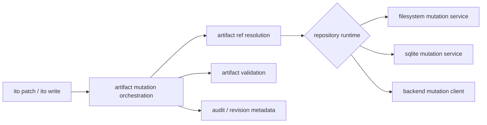

## Context

Ito already has the architectural shape we want for this work: repository traits in `ito-domain`, runtime-selected implementations in `ito-core`, and thin CLI adapters in `ito-cli`. The missing piece is a general artifact mutation path for things like change proposal text, design text, spec deltas, and promoted specs. Tasks already have a dedicated mutation service, which proves the pattern, but the rest of active-work authoring still depends on direct file edits.

At the same time, generated guidance has gotten ahead of the implementation. `.ito/AGENTS.md` and related assets already say that active-work mutations should go through repository-backed CLI paths, especially in remote mode, but there is no single CLI surface that lets an agent safely patch or write those artifacts without dropping back to the filesystem.

## Goals / Non-Goals

- Goals:
  - Add an Ito-native write/patch workflow for active-work artifacts.
  - Make the workflow repository-runtime-agnostic across filesystem, SQLite, and remote modes.
  - Update every relevant generated instruction surface so agents are consistently taught to use that workflow.
  - Add strong tests for both behavior and emitted guidance.
- Non-Goals:
  - Replacing specialized `ito tasks ...` status transitions with generic patch commands.
  - Removing generic file-edit tools from harnesses for normal code changes.
  - Inventing a brand-new persistence model outside Ito’s existing repository/runtime layering.

## Decisions

- Expose two additive CLI surfaces:
  - `ito patch ...` for targeted hunk-like updates.
  - `ito write ...` for whole-artifact replacement when that is more ergonomic.
- Model targets as Ito artifact references, not filesystem paths. Example targets include change proposal, change design, change tasks, change spec delta by capability, and promoted spec by id.
- Keep the patch engine in-memory and repository-backed. The CLI should never be the layer that decides how `.ito/...` files are laid out for mutation.
- Use a diff engine abstraction that can operate on text in memory; the implementation can adapt targeted patch text to the selected artifact contents and then persist through the selected runtime.
- Preserve task semantics: task lifecycle commands stay under `ito tasks ...`, even if they internally align with the broader mutation architecture later.

## Architecture Sketch



## Interface Sketch

Illustrative only; the exact type names may change.

```rust
pub enum ArtifactRef {
    ChangeProposal { change_id: String },
    ChangeDesign { change_id: String },
    ChangeTasks { change_id: String },
    ChangeSpecDelta { change_id: String, capability: String },
    PromotedSpec { spec_id: String },
}

pub trait ArtifactMutationService {
    fn write(&self, target: &ArtifactRef, content: &str) -> Result<ArtifactMutationResult, _>;
    fn patch(&self, target: &ArtifactRef, patch: &str) -> Result<ArtifactMutationResult, _>;
}
```

## Guidance Design

- Generated instructions should explicitly distinguish:
  - editing application code/files,
  - mutating Ito stateful artifacts,
  - scanning Git-projected history/specs.
- For Ito artifacts, the guidance should name `ito patch` / `ito write` directly.
- Harness assets may still expose `Edit` / `Write` tools for normal project files, but guidance should make clear that those are not the authoritative path for active Ito artifacts.

## Risks / Trade-offs

- Adding visible top-level commands increases CLI surface area, so we need to keep naming simple and behavior consistent.
- A custom patch grammar can be more ergonomic for LLMs but increases parser/validator work.
- Guidance-only changes without command ergonomics would not stick; command-only changes without guidance parity would still let harnesses drift back to file edits.

## Testing Strategy

- Unit tests for artifact ref resolution, mutation routing, and patch/write validation.
- Mode-specific tests for filesystem, SQLite, and remote-backed behavior.
- CLI tests for success cases, invalid target errors, and actionable conflict/revision messages.
- Instruction rendering tests covering apply/backend/other relevant artifacts.
- Template/harness tests proving installed/generated assets teach the same artifact-mutation workflow consistently.
