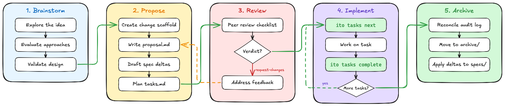

# Ito: Change-Driven Development for AI Agents

## A structured workflow for long-running, multi-session AI coding via agents

---

## About This Talk

- **Goal**: Walk through Ito's change lifecycle end-to-end
- **Format**: Live walkthrough with a realistic example change, driven through an agent

> We'll create a change from scratch through slash commands,
> review its anatomy, and see how change proposals, specs, tasks, and audit trail work together.

---

## What Is Ito?

**Ito** a change-driven dev tool for your coding agent.

Ito helps structure AI assisted developement by providing tools to

- Define changes
- Generate specs
- Guide implementation
- Track and Validate work


---

## Some Problems Ito Helps with

| Problem | Symptom |
|---------|---------|
| Lost context | Agent forgets across sessions |
| Scope creep | "Just one thing" spirals |
| No verification | "It works!" ...does it? |
| Spec drift | Code diverges from agreement |
| No audit trail | Who changed what, when? |

**Ito provides the rails** -- not project management, but a framework for structuring the work itself.

---

## The Change Lifecycle



---

## Let's Build a Change

Let's assume we have done our brainstorming and have decided we want to add a endpoint to the backend so clients can check which version is running.

```text
/ito-proposal We want to add a /api/v1/version endpoint to the
backend so clients can check which version is running.
```

This creates a change named `add-backend-version-endpoint` with the following files:

```
.ito/changes/add-backend-version-endpoint/
  |- design.md (optional)
  |- proposal.md
  |- tasks.md
  `- specs/
```

---

## Anatomy: proposal.md

```markdown
# Change: Add Backend Version Endpoint

## Why
Clients and ops tooling have no way to discover which version
of the backend is running. A lightweight `/api/v1/version`
endpoint enables health dashboards, deploy verification,
and client compatibility checks.

## What Changes
- New GET `/api/v1/version` route returning build metadata
- Version struct sourced from compile-time env vars
- No authentication required (public info)

## Impact
- Affected specs: backend-api
- Migration required: No
```

---

## Anatomy: design.md (optional)

```markdown
## Decisions
1. Compile-time version embedding (not config file) -- immutable
2. Single flat JSON response (not nested metadata) -- YAGNI
3. No auth required -- version is not sensitive

## Risks / Trade-offs
- Public endpoint: version info is observable -- acceptable
- Compile-time only: no runtime override -- can extend later
```

**When to write one**: cross-cutting changes, new dependencies, security/perf concerns, or architectural ambiguity.

---

## Anatomy: Spec Deltas

Specs = **what IS built**. Changes = **what SHOULD change**, as deltas.

```
.ito/changes/add-backend-version-endpoint/specs/
  |- backend-api/spec.md       # MODIFIED
  `- backend-version/spec.md   # ADDED
```

Four delta operations: `ADDED` | `MODIFIED` | `REMOVED` | `RENAMED`

---

## Spec Delta Example: ADDED

```markdown
## ADDED Requirements

### Requirement: Backend Version Endpoint
The system SHALL expose build version metadata
via a public API endpoint.

#### Scenario: Successful version request
- GIVEN the backend is running
- WHEN a client sends GET /api/v1/version
- THEN respond with 200 and a JSON body containing
  version, git_sha, and build_timestamp

#### Scenario: No authentication required
- GIVEN an unauthenticated client
- WHEN it sends GET /api/v1/version
- THEN the request succeeds without credentials
```

---

## Spec Delta Example: MODIFIED

```markdown
## MODIFIED Requirements

### Requirement: Backend API Route Registration
The system SHALL register all public and authenticated
routes under the /api/v1 prefix.

#### Scenario: Public routes
- GIVEN the backend is running
- WHEN routes are registered
- THEN /api/v1/health and /api/v1/version are
  accessible without authentication
```

`MODIFIED` pastes the **full updated requirement** -- not just the diff. This prevents information loss at archive time.

---

## Anatomy: tasks.md (Wave 1)

```markdown
## Wave 1: Version Model & Route
- **Depends On**: None

### Task 1.1: Define VersionInfo struct
- **Files**: `crates/backend/src/version.rs`
- **Action**: Define VersionInfo with version, git_sha, build_timestamp
- **Verify**: `cargo test -p backend --lib version`
- **Done When**: Struct serializes to JSON correctly
- **Status**: [ ] pending

### Task 1.2: Add GET /api/v1/version handler
- **Dependencies**: Task 1.1
- **Action**: Register route, return VersionInfo as JSON
- **Verify**: `cargo test -p backend --test api_version`
- **Done When**: Handler returns 200 with expected fields
- **Status**: [ ] pending
```

---

## Anatomy: tasks.md (Wave 2 & 3)

```markdown
## Wave 2: Build Metadata & Integration
- **Depends On**: Wave 1

### Task 2.1: Inject compile-time build metadata
- **Action**: Use env vars (CARGO_PKG_VERSION, GIT_SHA) at build time
- **Verify**: `cargo test -p backend --lib version_metadata`
- **Status**: [ ] pending

### Checkpoint 1: Integration review
- **Type**: checkpoint (requires human approval)
- **Dependencies**: Task 2.1

## Wave 3: Documentation & Spec Update
- **Depends On**: Wave 2, Checkpoint 1

### Task 3.1: Update API documentation
- **Action**: Add /api/v1/version to the route table docs
- **Verify**: `cargo doc -p backend --no-deps`
- **Status**: [ ] pending
```

---

## Understanding Waves & Tasks

Waves are **ordered phases**. Wave 2 waits for Wave 1.

```
Wave 1 (Route)   -->  Wave 2 (Build)  -->  Wave 3 (Docs)
   Task 1.1               Task 2.1           Task 3.1
   Task 1.2               Checkpoint 1
```

**Key rules:**
- Cross-wave task dependencies **forbidden**
- Intra-wave dependencies are fine
- Checkpoints gate progress (human approval)
- Every task has **Verify** + **Done When**

| `[ ]` pending | `[~]` in progress | `[x]` complete | `[-]` shelved |

---

## Validating the Change

```text
/ito-review add-backend-version-endpoint

  Agent runs strict validation before review:
  [OK] proposal.md: valid structure
  [OK] specs/backend-version/spec.md: valid delta (ADDED)
  [OK] specs/backend-api/spec.md: valid delta (MODIFIED)
  [OK] tasks.md: valid wave structure
  [OK] No cross-wave task dependencies
  [OK] All requirements have scenarios

  Result: PASS (6/6 checks)
```

Catches: missing scenarios, cross-wave deps, orphaned spec refs, malformed delta headers.

---

## The Review Phase

```markdown
### Proposal
- [note] Clear problem statement with practical use cases
- [suggestion] Mention caching headers for version response

### Spec Deltas
- [blocking] Missing scenario for build_timestamp format
- [suggestion] Add scenario for unknown git_sha (dirty build)

### Tasks
- [note] Good wave structure
- [suggestion] Add a task for error handling if env vars are missing

### Verdict: request-changes
```

Tags: `[blocking]` must fix | `[suggestion]` recommended | `[note]` informational

---

## Iterating on a Proposal

After review feedback:

1. Add the missing build_timestamp format scenario
2. Optionally add a task for missing env var fallback
3. Ask the agent to re-run `/ito-review <id>`
4. Re-submit once the review comes back clean

```
Propose --> Review --> Revise --> Review --> Approve
```

**No code is written until the proposal is approved.**

---

## Implementing the Change

```text
/ito-apply add-backend-version-endpoint

  Next ready: Task 1.1 - Define VersionInfo struct
  [~] Task 1.1 is now in-progress

  ... agent writes code, runs Verify command ...

  [x] Task 1.1 complete. Next ready: Task 1.2
  Wave 1: 1/2 | Wave 2: 0/1 (blocked) | Wave 3: 0/1
  Overall: 1/4 tasks (25%)
```

Audit log records every state transition automatically.

---

## The Audit Trail

Every state change is recorded in an append-only event log:

```json
{
  "entity": "task", "entity_id": "1.1",
  "scope": "add-backend-version-endpoint",
  "op": "status_change",
  "from": "pending", "to": "in-progress",
  "actor": "agent",
  "ctx": { "branch": "...", "commit": "3a7f2b1c" }
}
```

When an agent starts a new session, the audit log tells it exactly where things stand.

```text
/ito-list add-backend-version-endpoint      # where are we?
/ito-apply add-backend-version-endpoint     # resume next ready task
/ito-archive add-backend-version-endpoint   # close the loop
```

---

## Archiving a Completed Change

```text
/ito-archive add-backend-version-endpoint

  [1/4] Reconciling audit log... OK
  [2/4] Moving to archive/2026-03-23-.../ OK
  [3/4] Applying spec deltas...
        MODIFIED: specs/backend-api/spec.md
        ADDED:    specs/backend-version/spec.md
  [4/4] Validating final state... OK
```

**What happens:**
1. Deltas applied in order: RENAMED -> REMOVED -> MODIFIED -> ADDED
2. Change moves to `archive/` with date prefix
3. `specs/` now reflects the **new truth**
4. If any delta fails, **entire archive aborts** -- no partial updates

---

## Specs as Living Documentation

```
specs/                        # What IS built (truth)
  |- backend-api/spec.md
  |- backend-version/spec.md  <-- created by our change
  `- ... (150+ specs in Ito itself)

changes/archive/              # What WAS changed (history)
  |- 2026-03-23-add-backend-version-endpoint/
  `- ... (238+ archived changes in Ito itself)
```

Specs are never stale -- the archive process **forces** them to be updated.

The archive provides a complete trail of *why* each spec looks the way it does.

---

## Multi-Agent & Automation

**Subagent-Driven Development:**
```
Main Agent --> Subagent 1: Task 1.1
           --> Subagent 2: Task 1.2
           --> Review gate before Wave 2
```

**Ralph -- The AI Agent Loop:**
```text
/ito-loop --change <id>
/ito-loop --module 001 --continue-ready
```

Ralph picks the next task, launches an agent, reviews output, repeats.

---

## Modules & Skills

**Modules** group related changes into epics with scope enforcement:

```markdown
## Scope: backend-server, backend-auth
## Changes
- [x] 024-01_backend-serve-command
- [ ] 024-03_backend-change-api
```

**Skills** teach agents *how* to work (installed by `ito init`, invoked via slash commands):

| Workflow | Engineering | Multi-Agent |
|----------|-------------|-------------|
| proposal, apply | TDD, debugging | subagent dev |
| review, archive | verification | parallel dispatch |
| brainstorming | commit | test delegation |

Works across 5+ harnesses: Claude Code, OpenCode, Copilot, Codex...

---

## Installation & Quick Start

```text
# Install
brew tap withakay/ito && brew install ito

# Initialize in any repo
cd my-project && ito init

# Then work through your agent
/ito-proposal add-user-search
/ito-apply add-user-search

# Optional automation loop
/ito-loop --change add-user-search
```

`ito init` creates: `project.md`, `specs/`, `changes/`, `modules/`, `.state/`
Plus harness-specific adapters (skills, prompts, commands).

---

## Key Takeaways

1. **Specs are truth** -- always reflects what's built
2. **Changes are proposals** -- nothing built without review
3. **Deltas, not copies** -- express what's different
4. **Tasks have verification** -- explicit acceptance criteria
5. **Audit trail remembers** -- agents resume across sessions
6. **Archive closes the loop** -- deltas merge back into specs

```
Specs (truth) --> Changes (proposals) --> Code
   ^                                       |
   `-------- Archive (apply deltas) -------'
```

---

## Resources & Questions

- **GitHub**: github.com/withakay/ito
- **Install**: `brew tap withakay/ito && brew install ito`
- **Inspirations**: EARS, RFCs, software dev best practices

> *"Ito doesn't manage your project. It structures the work."*

```bash
brew tap withakay/ito && brew install ito
cd your-repo && ito init
```
