# Ito: Change-Driven Development for AI Agents

### A structured workflow for long-running, multi-session AI coding

---

## About This Talk

- **Duration**: ~20 minutes
- **Goal**: Walk through Ito's change lifecycle end-to-end
- **Format**: Live walkthrough with a realistic example change

> We'll create a change from scratch, review its anatomy,
> and see how specs, tasks, and the audit trail work together.

---

## What Is Ito?

**Ito** (糸 "thread" / 意図 "intention") -- a change-driven dev tool for your terminal.

It structures AI-assisted development that:

- Spans **multiple sessions** (the agent resumes where it left off)
- Needs **explicit verification** (not just "it compiles")
- Benefits from **parallel subagents** (divide and conquer)

### The Core Invariant

> **Specs are truth. Changes are proposals. Keep them in sync.**

---

## The Problem Ito Solves

| Problem | Symptom |
|---------|---------|
| Lost context | Agent forgets across sessions |
| Scope creep | "Just one thing" spirals |
| No verification | "It works!" ...does it? |
| Spec drift | Code diverges from agreement |
| No audit trail | Who changed what, when? |

**Ito provides the rails** -- not project management, but a framework for structuring the work itself.

---

## The Change Lifecycle



---

## Let's Build a Change

We want to add email notifications when API keys are about to expire.

**Do we need a proposal?**
- Bug fix? No -- new behavior
- Typo/config? No -- adds functionality
- New feature? **Yes** -- create a proposal

```bash
ito create change add-api-key-expiry-notifications
```

```
.ito/changes/add-api-key-expiry-notifications/
  |- proposal.md
  |- tasks.md
  `- specs/
```

---

## Anatomy: proposal.md

```markdown
# Change: Add API Key Expiry Notifications

## Why
Users are caught off guard when API keys expire, causing
service disruptions. Proactive notifications at 30/7/1 days
before expiry would reduce surprise expirations by ~80%.

## What Changes
- Scheduled job checking key expiry dates daily
- Templated email notifications at 30/7/1 day thresholds
- User preference to opt out
- **BREAKING**: `notification_preferences` column on users

## Impact
- Affected specs: api-keys, notifications, user-preferences
- Migration required: Yes (new DB column)
```

---

## Anatomy: design.md (optional)

```markdown
## Decisions
1. Daily cron job (not event-driven) -- simpler
2. Existing email service (not new microservice) -- YAGNI
3. `key_notifications` table to prevent duplicates

## Risks / Trade-offs
- Cron: up to 24h delivery window -- acceptable
- Email-only: no SMS/push -- can extend later
```

**When to write one**: cross-cutting changes, new dependencies, security/perf concerns, or architectural ambiguity.

---

## Anatomy: Spec Deltas

Specs = **what IS built**. Changes = **what SHOULD change**, as deltas.

```
.ito/changes/add-api-key-expiry-notifications/specs/
  |- api-keys/spec.md          # MODIFIED
  |- notifications/spec.md     # ADDED
  `- user-preferences/spec.md  # MODIFIED
```

Four delta operations: `ADDED` | `MODIFIED` | `REMOVED` | `RENAMED`

---

## Spec Delta Example: ADDED

```markdown
## ADDED Requirements

### Requirement: API Key Expiry Email Notifications
The system SHALL send email notifications when
API keys are approaching expiry.

#### Scenario: 30-day warning
- GIVEN a key expiring in 30 days
- AND the user has not opted out
- WHEN the daily notification job runs
- THEN send a "30 days remaining" email

#### Scenario: Duplicate prevention
- GIVEN a 30-day notification was already sent
- WHEN the job runs again
- THEN no duplicate email is sent
```

---

## Spec Delta Example: MODIFIED

```markdown
## MODIFIED Requirements

### Requirement: API Key Lifecycle Management
The system SHALL manage API keys through creation,
rotation, expiry, and notification phases.

#### Scenario: Key approaching expiry
- GIVEN an API key has an expiry date set
- WHEN the key is within 30 days of expiry
- THEN the key is eligible for notifications
```

`MODIFIED` pastes the **full updated requirement** -- not just the diff. This prevents information loss at archive time.

---

## Anatomy: tasks.md (Wave 1)

```markdown
## Wave 1: Domain Model & Database
- **Depends On**: None

### Task 1.1: Create KeyNotification domain model
- **Files**: `crates/domain/src/notifications/key_notification.rs`
- **Action**: Define KeyNotification struct
- **Verify**: `cargo test -p domain --lib notifications`
- **Done When**: Model serializes to/from DB row
- **Status**: [ ] pending

### Task 1.2: Add database migration
- **Dependencies**: Task 1.1
- **Action**: Create key_notifications table
- **Verify**: `cargo run -- migrate && ... rollback`
- **Done When**: Migration applies and rolls back cleanly
- **Status**: [ ] pending
```

---

## Anatomy: tasks.md (Wave 2 & 3)

```markdown
## Wave 2: Notification Logic
- **Depends On**: Wave 1

### Task 2.1: Implement expiry checker
- **Action**: Query expiring keys, skip already-sent
- **Verify**: `cargo test -p scheduler --lib key_expiry`
- **Status**: [ ] pending

### Checkpoint 1: Integration review
- **Type**: checkpoint (requires human approval)
- **Dependencies**: Task 2.1, Task 2.2

## Wave 3: User Preferences
- **Depends On**: Wave 2, Checkpoint 1

### Task 3.1: Add opt-out preference
- **Action**: Add boolean to user prefs, expose via API
- **Verify**: `cargo test -p api --lib user_preferences`
- **Status**: [ ] pending
```

---

## Understanding Waves & Tasks

Waves are **ordered phases**. Wave 2 waits for Wave 1.

```
Wave 1 (Domain)  -->  Wave 2 (Logic)  -->  Wave 3 (Prefs)
   Task 1.1               Task 2.1           Task 3.1
   Task 1.2               Task 2.2
                           Checkpoint 1
```

**Key rules:**
- Cross-wave task dependencies **forbidden**
- Intra-wave dependencies are fine
- Checkpoints gate progress (human approval)
- Every task has **Verify** + **Done When**

| `[ ]` pending | `[~]` in progress | `[x]` complete | `[-]` shelved |

---

## Validating the Change

```bash
$ ito validate add-api-key-expiry-notifications --strict

  [OK] proposal.md: valid structure
  [OK] specs/notifications/spec.md: valid delta (ADDED)
  [OK] specs/api-keys/spec.md: valid delta (MODIFIED)
  [OK] tasks.md: valid wave structure
  [OK] No cross-wave task dependencies
  [OK] All requirements have scenarios

  Result: PASS (6/6 checks)
```

Catches: missing scenarios, cross-wave deps, orphaned spec refs, malformed delta headers.

---

## The Review Phase

```markdown
### Proposal
- [note] Clear problem statement with quantified impact
- [suggestion] Mention support ticket volume

### Spec Deltas
- [blocking] Missing scenario for 1-day threshold
- [suggestion] Add scenario for keys with no expiry

### Tasks
- [note] Good wave structure
- [suggestion] Split Task 2.2: template vs. send

### Verdict: request-changes
```

Tags: `[blocking]` must fix | `[suggestion]` recommended | `[note]` informational

---

## Iterating on a Proposal

After review feedback:

1. Add the missing 1-day scenario
2. Optionally split Task 2.2 per suggestion
3. Re-validate: `ito validate <id> --strict`
4. Submit for re-review

```
Propose --> Review --> Revise --> Review --> Approve
```

**No code is written until the proposal is approved.**

---

## Implementing the Change

```bash
$ ito tasks next add-api-key-expiry-notifications
  Next ready: Task 1.1 - Create KeyNotification model

$ ito tasks start add-api-key-expiry-notifications 1.1
  [~] Task 1.1 is now in-progress

# ... write code, run verify command ...

$ ito tasks complete add-api-key-expiry-notifications 1.1
  [x] Task 1.1 complete. Next ready: Task 1.2

$ ito tasks status add-api-key-expiry-notifications
  Wave 1: 1/2 | Wave 2: 0/2 (blocked) | Wave 3: 0/1
  Overall: 1/5 tasks (20%)
```

Audit log records every state transition automatically.

---

## The Audit Trail

Every state change is recorded in an append-only event log:

```json
{
  "entity": "task", "entity_id": "1.1",
  "scope": "add-api-key-expiry-notifications",
  "op": "status_change",
  "from": "pending", "to": "in-progress",
  "actor": "cli",
  "ctx": { "branch": "...", "commit": "3a7f2b1c" }
}
```

When an agent starts a new session, the audit log tells it exactly where things stand.

```bash
ito audit log --change <id>   # view events
ito audit validate             # verify integrity
ito audit reconcile            # detect and fix drift
```

---

## Archiving a Completed Change

```bash
$ ito archive add-api-key-expiry-notifications -y

  [1/4] Reconciling audit log... OK
  [2/4] Moving to archive/2026-03-23-.../ OK
  [3/4] Applying spec deltas...
        MODIFIED: specs/api-keys/spec.md
        ADDED:    specs/notifications/spec.md
  [4/4] Validating final state... OK
```

**What happens:**
1. Deltas applied in order: RENAMED -> REMOVED -> MODIFIED -> ADDED
2. Change moves to `archive/` with date prefix
3. `specs/` now reflects the **new truth**
4. If any delta fails, **entire archive aborts** -- no partial updates

---

## Specs as Living Documentation

```
specs/                        # What IS built (truth)
  |- api-keys/spec.md
  |- notifications/spec.md    <-- created by our change
  `- ... (150+ specs in Ito itself)

changes/archive/              # What WAS changed (history)
  |- 2026-03-23-add-api-key-expiry-notifications/
  `- ... (238+ archived changes in Ito itself)
```

Specs are never stale -- the archive process **forces** them to be updated.

The archive provides a complete trail of *why* each spec looks the way it does.

---

## Multi-Agent & Automation

**Subagent-Driven Development:**
```
Main Agent --> Subagent 1: Task 1.1
           --> Subagent 2: Task 1.2
           --> Review gate before Wave 2
```

**Ralph -- The AI Agent Loop:**
```bash
ito ralph --change <id> --harness opencode --max-iterations 5
ito ralph --module 001 --continue-ready
```

Ralph picks the next task, launches an agent, reviews output, repeats.

---

## Modules & Skills

**Modules** group related changes into epics with scope enforcement:

```markdown
## Scope: backend-server, backend-auth
## Changes
- [x] 024-01_backend-serve-command
- [ ] 024-03_backend-change-api
```

**Skills** teach agents *how* to work (installed by `ito init`):

| Workflow | Engineering | Multi-Agent |
|----------|-------------|-------------|
| proposal, apply | TDD, debugging | subagent dev |
| review, archive | verification | parallel dispatch |
| brainstorming | commit | test delegation |

Works across 5+ harnesses: Claude Code, OpenCode, Copilot, Codex...

---

## Installation & Quick Start

```bash
# Install
brew tap withakay/ito && brew install ito

# Initialize in any repo
cd my-project && ito init

# Create your first change
ito create change add-user-search

# Let an agent implement it
ito ralph --change add-user-search --harness opencode
```

`ito init` creates: `project.md`, `specs/`, `changes/`, `modules/`, `.state/`
Plus harness-specific adapters (skills, prompts, commands).

---

## Key Takeaways

1. **Specs are truth** -- always reflects what's built
2. **Changes are proposals** -- nothing built without review
3. **Deltas, not copies** -- express what's different
4. **Tasks have verification** -- explicit acceptance criteria
5. **Audit trail remembers** -- agents resume across sessions
6. **Archive closes the loop** -- deltas merge back into specs

```
Specs (truth) --> Changes (proposals) --> Code
   ^                                       |
   `-------- Archive (apply deltas) -------'
```

---

## Resources & Questions

- **GitHub**: github.com/withakay/ito
- **Install**: `brew tap withakay/ito && brew install ito`
- **Inspirations**: EARS, RFCs, software dev best practices

> *"Ito doesn't manage your project. It structures the work."*

```bash
brew tap withakay/ito && brew install ito
cd your-repo && ito init
```
